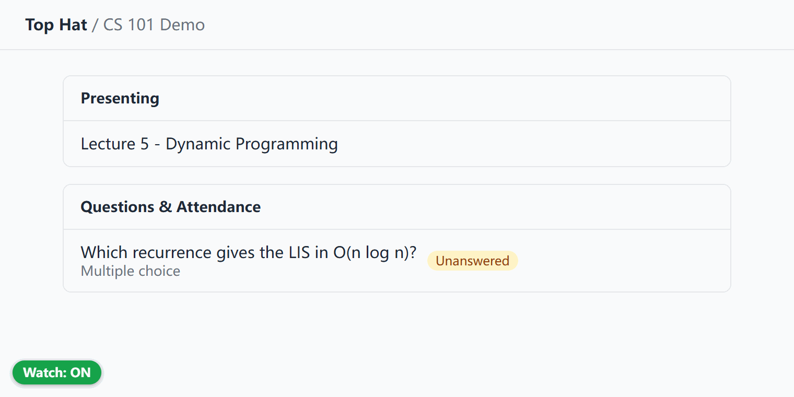
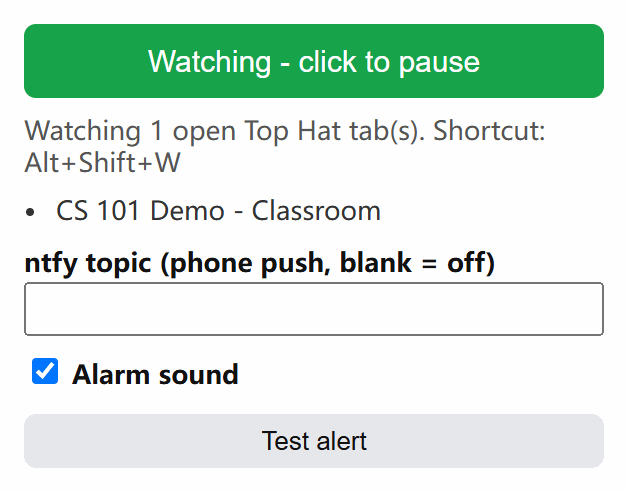

#  Top Hat Watch

Get a desktop notification, a beep, and a phone push the moment a Top Hat question or attendance check goes live.


<p>
  
  
</p>

## Why

In a big lecture, Top Hat questions and attendance codes open without warning and close fast. If you're looking at your notes or another tab, you miss the points. This watches the Classroom tab for you and tells you right away.

## Features

- **No setup per course.** It watches whatever Top Hat course tabs you already have open.
- **Only alerts when you need to act.** It skips answered or closed questions and attendance you've already checked in to. An item that opens again triggers another alert.
- **Three alert channels:** a Chrome notification that stays until you dismiss it (click it to jump to the tab), a beep, and an optional [ntfy](https://ntfy.sh) push to your phone.
- **On-page status pill:** green means watching, amber means you're on a page that isn't the Classroom tab, and grey means paused.
- **Quick toggle:** pause and resume from the pill, the toolbar popup, or <kbd>Alt</kbd>+<kbd>Shift</kbd>+<kbd>W</kbd>.

## Install (Chrome extension)

1. Clone or download this repo.
2. Open `chrome://extensions` and turn on **Developer mode**.
3. Click **Load unpacked** and select the `extension` folder.
4. Open a course's **Classroom** tab (`app.tophat.com/e/<id>/lecture`) and leave it open.

### Phone push (optional)

1. Install the **ntfy** app and subscribe to a topic. Pick a long random name: anyone who knows it can read your pushes.
2. Enter that topic in the extension popup. To keep it out of git, you can instead put it in `extension/local.json` (this file is gitignored):

   ```json
   { "ntfyTopic": "your-long-random-topic" }
   ```

Click **Test alert** in the popup to check all three channels.

## How it works

A content script on `app.tophat.com` watches the page for DOM changes, with a rescan every 5 s as a backup. It reads the *Questions & Attendance* section of the Classroom tab and treats an item as pending unless it is marked `list-row--answered`, "Answered", or "Closed", or unless "You have been marked present" shows for attendance. On other Top Hat pages it falls back to Top Hat's own new-question toast. The service worker keeps track of which items have already alerted and sends the notifications. An offscreen document plays the sound.

| Permission | Used for |
|---|---|
| `tabs`, host `app.tophat.com` | find open course tabs and read their Classroom list |
| `notifications`, `offscreen` | desktop alert and alarm sound |
| `storage`, `alarms` | settings and periodic checks |
| host `ntfy.sh` | phone push; nothing is sent if no topic is set |

No data leaves your browser except the ntfy push you configure.

## Python version (standalone)

`watch.py` does the same job with its own headless Chrome (Playwright, about 1.4 GB of RAM). Use it if you'd rather not keep Top Hat open in your own browser.

1. Copy `config.example.json` to `config.json` and set `ntfy_topic`.
2. Run `python watch.py --login` and sign in with NetID and Duo. The session is kept in `profile/`.
3. Run `toggle.ps1` to turn it on or off. It stops by itself after 3 h.

| Command | What it does |
|---|---|
| `python watch.py --test` | sends a test alert (toast, sound, and phone) |
| `python watch.py` | starts watching (headless) |
| `python watch.py --show` | starts watching with a visible browser |
| `start.ps1` / `stop.ps1` | starts or stops it in the background |
| `install-task.ps1` | registers autostart at logon (optional) |

Along with the Classroom list, the Python version also watches for the new-question toast, an increase in the unanswered-count badge, and an auto-opened question form. Some of these selectors come from other open-source notifiers ([twangodev/tophat-bot](https://github.com/twangodev/tophat-bot), [AndrewW-coder/TopHatNotifier](https://github.com/AndrewW-coder/TopHatNotifier), [CSNBS/TopHat-Tracker](https://github.com/CSNBS/TopHat-Tracker)). It writes alerts to `logs/watch-*.log`. Raw WebSocket frames go to `logs/ws-*.log` in case Top Hat changes its UI and detection needs retuning.

## Screenshots

`python docs/screenshots.py` rebuilds the images above. It loads the extension into Playwright Chromium and serves a mock Classroom page in place of `app.tophat.com`. It also checks that the extension really fires the question notification.

## Limits

- Detection depends on Top Hat's current DOM (last checked 2026-09-22). A UI redesign can break it.
- Chrome has to be running with the course tab open. Watched tabs are marked non-discardable so Chrome's memory saver doesn't unload them.
