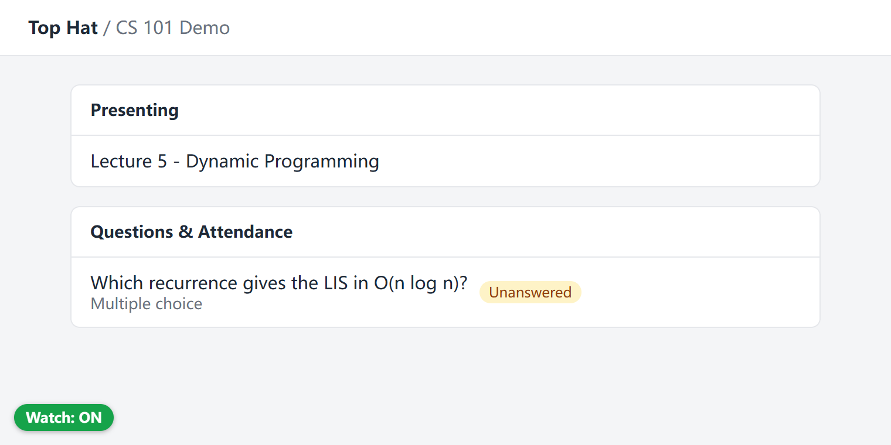
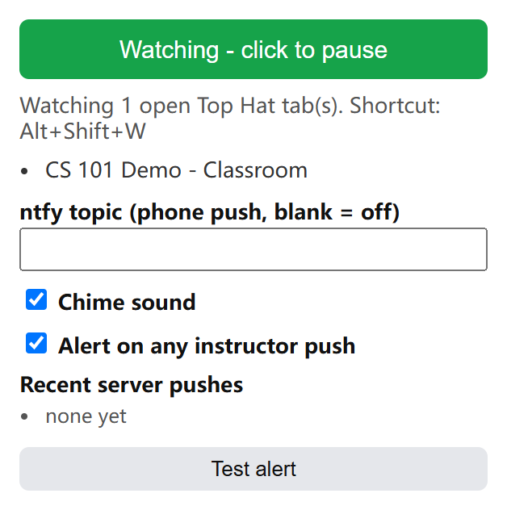

#  Top Hat Watch

Get a gentle reminder (desktop notification, a soft chime, and a phone push) the moment the instructor pushes anything in Top Hat: a question, an attendance check, a newly presented item, or new course material.


<p>
  
  
</p>

## Why

In a big lecture, Top Hat questions and attendance codes open without warning and close fast. If you're looking at your notes or another tab, you miss the points. This watches the Classroom tab for you and tells you right away.

## Features

- **No setup per course.** It watches whatever Top Hat course tabs you already have open.
- **Catches every instructor push.** It listens to Top Hat's own live-update WebSocket, so anything the server pushes to your tab raises an alert, even if the page doesn't change in a way the scanner recognizes. Repeats of the same push type within 90 s (for example slide flips) stay quiet.
- **Specific alerts when it can.** Open questions and attendance get their own alert with the question title; answered or closed items and attendance you've already checked in to are skipped. Changes under *Presenting* and new entries in other sections alert too.
- **Three low-key channels:** a Chrome notification that fades on its own (click it to jump to the tab), a soft two-note chime, and an optional [ntfy](https://ntfy.sh) push to your phone at normal priority. No alarm sounds.
- **On-page status pill:** green means watching, amber means you're on a page that isn't the Classroom tab, and grey means paused.
- **Quick toggle:** pause and resume from the pill, the toolbar popup, or <kbd>Alt</kbd>+<kbd>Shift</kbd>+<kbd>W</kbd>.

## Install (Chrome extension)

1. Clone or download this repo.
2. Open `chrome://extensions` and turn on **Developer mode**.
3. Click **Load unpacked** and select the `extension` folder.
4. Open a course's **Classroom** tab (`app.tophat.com/e/<id>/lecture`) and leave it open.

### Phone push (optional)

1. Install the **ntfy** app and subscribe to a topic. Pick a long random name: anyone who knows it can read your pushes.
2. Enter that topic in the extension popup. To keep it out of git, you can instead put it in `extension/local.json` (this file is gitignored):

   ```json
   { "ntfyTopic": "your-long-random-topic" }
   ```

Click **Test alert** in the popup to check all three channels.

## How it works

Two layers. First, a small script injected into the page world at `document_start` wraps `window.WebSocket` and forwards every server frame except heartbeats, pongs, and auth handshakes (SockJS and Socket.IO framing are both understood). Frames in the first 8 s after load are treated as initial state. The service worker waits 3 s, and if the DOM layer hasn't already alerted for that course, fires a generic "instructor pushed something" alert. The popup lists the last few pushes so you can see what Top Hat sends.

Second, a content script watches the page for DOM changes, with a rescan every 5 s as a backup. It reads the *Questions & Attendance* section of the Classroom tab and treats an item as pending unless it is marked `list-row--answered`, "Answered", or "Closed", or unless "You have been marked present" shows for attendance. On other Top Hat pages it falls back to Top Hat's own new-question toast. The service worker keeps track of which items have already alerted and sends the notifications. An offscreen document plays the sound.

| Permission | Used for |
|---|---|
| `tabs`, host `app.tophat.com` | find open course tabs and read their Classroom list |
| `notifications`, `offscreen` | desktop notification and chime |
| `storage`, `alarms` | settings and periodic checks |
| host `ntfy.sh` | phone push; nothing is sent if no topic is set |

No data leaves your browser except the ntfy push you configure.

## Python version (standalone)

`watch.py` does the same job with its own headless Chrome (Playwright, about 1.4 GB of RAM). Use it if you'd rather not keep Top Hat open in your own browser.

1. Copy `config.example.json` to `config.json` and set `ntfy_topic`.
2. Run `python watch.py --login` and sign in with NetID and Duo. The session is kept in `profile/`.
3. Run `toggle.ps1` to turn it on or off. It stops by itself after 3 h.

| Command | What it does |
|---|---|
| `python watch.py --test` | sends a test alert (toast, sound, and phone) |
| `python watch.py` | starts watching (headless) |
| `python watch.py --show` | starts watching with a visible browser |
| `start.ps1` / `stop.ps1` | starts or stops it in the background |
| `install-task.ps1` | registers autostart at logon (optional) |

The Python version also alerts on WebSocket pushes (same filtering and cooldown; `push_alerts` and `push_cooldown_seconds` in `config.json`). Along with the Classroom list, it also watches for the new-question toast, an increase in the unanswered-count badge, and an auto-opened question form. Some of these selectors come from other open-source notifiers ([twangodev/tophat-bot](https://github.com/twangodev/tophat-bot), [AndrewW-coder/TopHatNotifier](https://github.com/AndrewW-coder/TopHatNotifier), [CSNBS/TopHat-Tracker](https://github.com/CSNBS/TopHat-Tracker)). It writes alerts to `logs/watch-*.log`. Raw WebSocket frames go to `logs/ws-*.log` in case Top Hat changes its UI and detection needs retuning.

## Screenshots

`python docs/test_push.py` runs an end-to-end check of the push alerts against a mock page and a mock WebSocket.

`python docs/screenshots.py` rebuilds the images above. It loads the extension into Playwright Chromium and serves a mock Classroom page in place of `app.tophat.com`. It also checks that the extension really fires the question notification.

## Limits

- Detection depends on Top Hat's current DOM (last checked 2026-09-22). A UI redesign can break it.
- Chrome has to be running with the course tab open. Watched tabs are marked non-discardable so Chrome's memory saver doesn't unload them.
